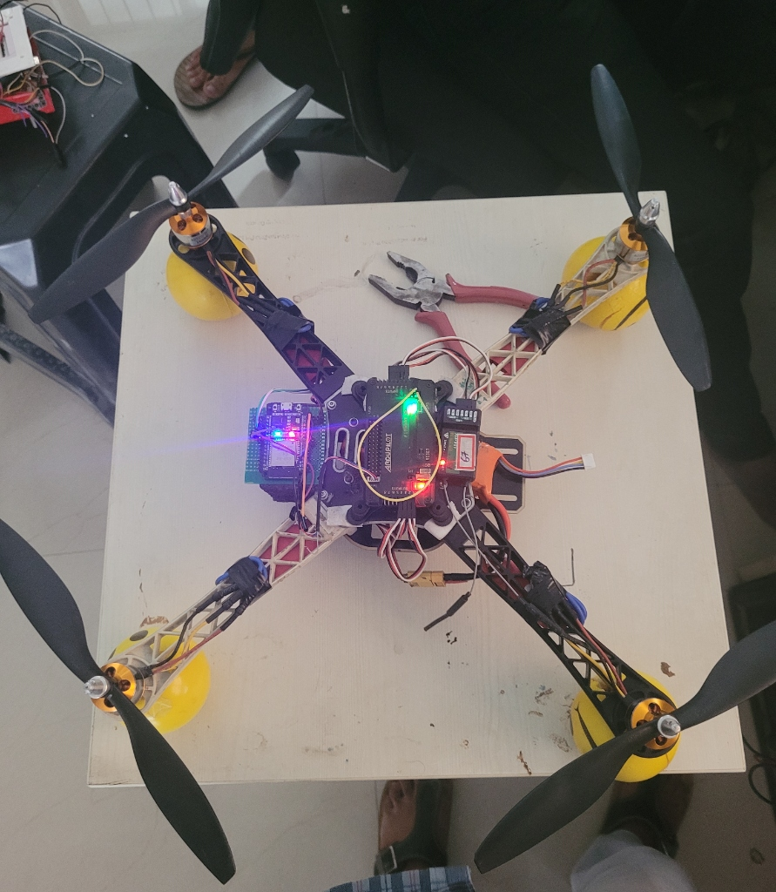
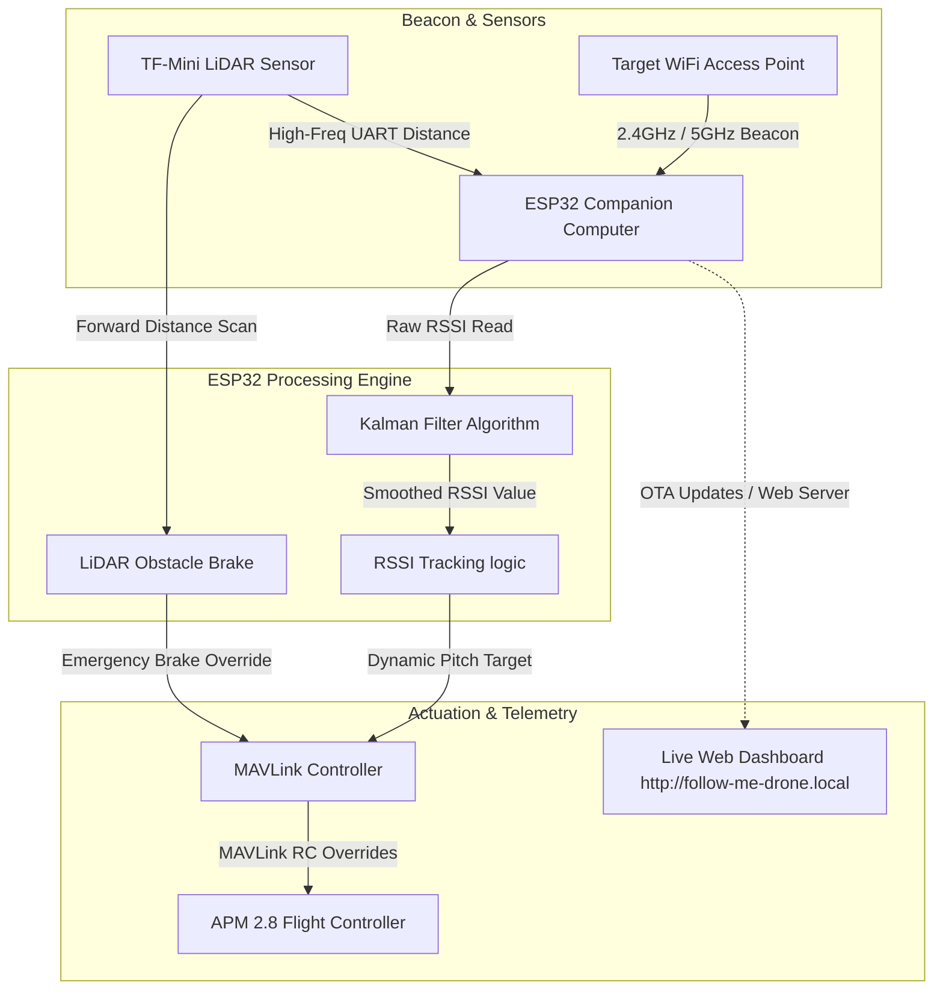

# 📡 WiFi RSSI Follow-Me companion Computer
**GPS-Denied Indoor Tracking System Mapped via Kalman-Filtered WiFi Telemetry & LiDAR Safety Overrides**

[](https://github.com/yogesh031020/wifi-follow-me-drone)
[](https://www.espressif.com/)
[](https://github.com/yogesh031020/wifi-follow-me-drone)
[](https://github.com/yogesh031020/wifi-follow-me-drone)

---

## 🚀 Project Overview
**WiFi Follow-Me Drone** is an autonomous companion computer system designed for **GPS-denied indoor tracking and navigation**. Running natively on an **ESP32**, the system uses raw RSSI (Received Signal Strength Indication) signal scans to dynamically track a mobile WiFi Access Point. 

The ESP32 processes high-frequency signals, stabilizes them via an integrated **Kalman Filter**, evaluates collision distances using a **TF-Mini LiDAR**, and sends real-time flight commands to an **APM 2.8 flight controller** over **MAVLink** (RC overrides).

---

## 📸 Avionics Showcase
<div align="center">
  
  <p><i>ESP32 Companion Board & TF-Mini LiDAR Integrated on APM 2.8 Test Quadcopter</i></p>
</div>

---

## 🧠 System Architecture & Control Loop
The companion computer processes signals from the physical tracking beacon and obstacle sensors, outputting dynamic MAVLink overrides to maintain a safe tracking distance:



---

## 🔌 Systems Engineering: Key Technical Challenges

> [!WARNING]  
> **Highly Noisy RSSI Signals (Signal Flutter)**  
> **Challenge:** Raw RSSI signal values jumped by ±8 dBm even when stationary. This caused the drone to oscillate violently back and forth in flight.  
> **Solution:** Implemented an optimized **Kalman Filter** algorithm (`wifi_tracking.h`) to smooth signal fluctuations, successfully delivering smooth transitions and stable hover states.

> [!IMPORTANT]  
> **MAVLink Telemetry Frame Drops**  
> **Challenge:** Under heavy Web Server dashboard traffic, high ESP32 CPU load caused telemetry packet drops, resulting in lost connection failsafes.  
> **Solution:** Designed a dynamic polling scheduler that automatically throttles MAVLink updates when web dashboard connections spike, protecting critical flight overrides.

> [!TIP]  
> **Failsafe ARM Verification**  
> **Challenge:** To prevent unintended bench takeoff, the system must not emit random commands.  
> **Solution:** Implemented strict state-machine checks to verify the APM is in `STABILIZE` mode and fully `ARMED` before executing any RC override commands.

---

## ⚙️ Configuration & Hardware Mappings
The hardware integrates companion logic, time-of-flight distance estimation, and telemetry:

| Component | Hardware Module | Role | Interface / Mapped Pins |
| :--- | :--- | :--- | :--- |
| **Companion MCU** | ESP32-WROOM-32 | Core Decision Logic & Web Server | - |
| **Flight Controller** | APM 2.8 | Low-level Flight Dynamics & ESC Control | Telemetry Serial2 (TX2/RX2) to ESP32 |
| **Distance Sensor** | TF-Mini LiDAR | Forward Obstacle Collision Detection | UART Serial1 (TX: GPIO 17, RX: GPIO 16) |
| **Signal Receiver** | FlySky iA6B | Manual RC Override Receiver | APM Mapped Channels |
| **Communication** | ESP32 Internal Antenna | RSSI Access Point Sniffing | 2.4GHz WiFi Radio Band |

Edit default tolerances inside `config.h` before flashing:
```cpp
#define TRACK_SSID "your-phone-hotspot"
#define FOLLOW_TARGET_RSSI   -55.0   // Ideal tracking distance setpoint (dBm)
#define FOLLOW_DEADZONE       5.0    // ±dBm deadzone tolerance
#define OBSTACLE_CLOSE_CM    80      // Hard brake distance for LiDAR (cm)
```

---

## 📂 Repository Directory Layout
```directory
wifi-follow-me-drone/
├── config.h               # Core threshold, SSID, and calibration macros
├── lidar.h                # TF-Mini LiDAR UART parser and data interface
├── mavlink_comm.h         # MAVLink protocol encoder and serial transmitter
├── wifi_tracking.h        # Kalman filter algorithm & RSSI smoothing logic
├── wifi_follow_me.ino     # Primary Arduino sketch containing core loop & Web HUD
├── docs/
│   ├── FollowMe_Wiring_Map.md   # Detailed hardware wiring pinout schematic
│   ├── FollowMe_execution_trace.log # Flight boot & collision avoidance debug trace
│   └── images/
│       └── wifi_drone.jpg       # Integrated flight hardware visual reference
└── LICENSE                # MIT License
```

---

### **Aeronautical & Autonomy Systems Engineering Portfolio**
*   **Developed by:** Yogesh E S - Aeronautical Systems Engineer
*   **Contact/Portfolio:** [GitHub Profile](https://github.com/yogesh031020)
