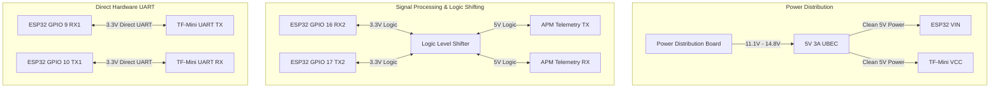

# 🔌 WiFi Follow-Me Companion Computer: Systems Wiring Map
**Comprehensive Electrical Wiring, Logic Level Translation, and Pinout Configurations**

This document establishes the electrical interfaces and pin mapping between the **ESP32 companion computer**, the **APM 2.8 flight controller**, and the **TF-Mini LiDAR sensor**.

---

## 📊 Schematic Topology

---

## ⚡ Core Wiring Map

### 1. Power Distribution Rail
The ESP32 WiFi transmitter draws significant current transients during operation. It must **never** be powered directly from the APM 2.8 board pins, as this can crash the main flight sensors.

| Source | Voltage | Destination Pin | Purpose |
| :--- | :--- | :--- | :--- |
| **5V UBEC Output** | `5V (VCC)` | ESP32 `VIN` / `5V` | Primary companion logic power |
| **5V UBEC Output** | `5V (VCC)` | TF-Mini `VCC` | Primary LiDAR laser sensor power |
| **PDB Ground** | `GND` | ESP32 `GND` | System Ground Reference |
| **PDB Ground** | `GND` | TF-Mini `GND` | Sensor Ground Reference |

---

### 2. Signal & Communication Pinouts

| Device 1 (From) | Pin Mapped | Protocol / Bus | Device 2 (To) | Pin Mapped | Electrical Level |
| :--- | :--- | :--- | :--- | :--- | :--- |
| **ESP32** | `GPIO 16 (RX2)` | MAVLink Telemetry | **APM 2.8** | `TX (Serial2)` | **Requires LLS (5V ↔ 3.3V)** |
| **ESP32** | `GPIO 17 (TX2)` | MAVLink Telemetry | **APM 2.8** | `RX (Serial2)` | **Requires LLS (5V ↔ 3.3V)** |
| **ESP32** | `GPIO 9 (RX1)` | LiDAR UART | **TF-Mini** | `TX (Serial1)` | Direct 3.3V UART |
| **ESP32** | `GPIO 10 (TX1)` | LiDAR UART | **TF-Mini** | `RX (Serial1)` | Direct 3.3V UART |

---

## ⚠️ Critical Avionics Engineering Instructions

> [!WARNING]  
> **Logic Level Translation is Mandatory**  
> The APM 2.8 telemetry port runs strictly on **5.0V Logic**. The ESP32 pins are **3.3V and NOT 5.0V tolerant**. Mismatched voltages will burn the ESP32 input registers. You **MUST** run the RX2/TX2 line through a bi-directional Logic Level Shifter (LLS) board.

> [!IMPORTANT]  
> **Clean BEC Sourcing**  
> The TF-Mini LiDAR and the ESP32 draw significant power. Connecting them to the APM's 5.5V rail will result in current starvation, immediately triggering a brown-out reset in flight. Always use a dedicated **5V 3A UBEC** wired to the main Power Distribution Board (PDB) to supply clean power.

> [!TIP]  
> **Antenna Shielding & Isolation**  
> Carbon fiber is electrically conductive and will severely shield or block WiFi radio waves. Secure the ESP32 companions away from carbon fiber frame brackets and direct battery blocks to maintain optimal RSSI sniffing performance.
